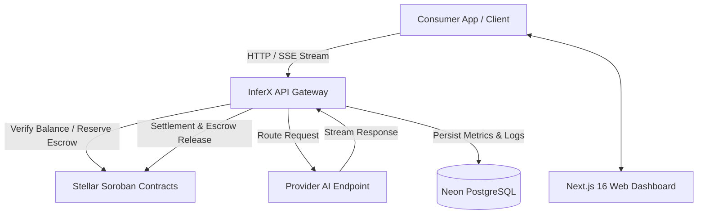

# InferX Technical Proposal & Architectural Blueprint

## Executive Summary

**InferX** is a decentralized, high-throughput AI inference marketplace built on the **Stellar Blockchain** and powered by **Soroban Smart Contracts**. InferX bridges AI model providers and API consumers, enabling per-request micro-payments in Stellar Lumens (XLM) without subscription locks, middleman overhead, or central counterparty risks.

Through automated smart contract escrow, cryptographic API signatures, and transparent reputation metrics, InferX empowers developers to monetize any open-source or proprietary LLM while giving consumers seamless access to enterprise-grade AI through a unified OpenAI-compatible API.

---

## 1. System Architecture

InferX is built on a modern, decoupled microservices architecture designed for ultra-low latency inference and trustless settlement.



### Core Components
1. **Unified API Gateway (`/api/chat/completions`)**: Next.js 16 serverless gateway supporting standard OpenAI chat completion payloads, vision inputs, and Server-Sent Events (SSE) streaming.
2. **Stellar Soroban Smart Contracts**: Rust-based smart contracts deployed on Stellar Testnet/Mainnet managing provider registration, escrow lockup, rating aggregation, and batch settlement.
3. **Database Layer (Neon PostgreSQL + Prisma ORM)**: High-performance relational storage for users, endpoints, transaction records, and analytics.
4. **Web Dashboard**: Dynamic Next.js client featuring real-time analytics, provider endpoint creation, interactive chat UI, and wallet integration (Freighter).

---

## 2. Soroban Smart Contract Architecture

InferX leverages four specialized Soroban smart contracts written in Rust:

### 2.1 Registry Contract (`contracts/contracts/registry`)
- **Purpose**: Decentralized directory of AI providers and model endpoints.
- **Key Functions**:
  - `register_provider(provider_address, name, metadata_uri)`
  - `register_endpoint(endpoint_id, model_name, price_per_req_xlm)`
  - `update_endpoint_status(endpoint_id, is_active)`

### 2.2 Escrow Contract (`contracts/contracts/escrow`)
- **Purpose**: Holds consumer funds safely until inference responses pass cryptographic verification or timeout.
- **Key Functions**:
  - `deposit_escrow(consumer, amount)`
  - `release_escrow(escrow_id, provider, amount, platform_fee)`
  - `refund_escrow(escrow_id, consumer)`

### 2.3 Ratings Contract (`contracts/contracts/ratings`)
- **Purpose**: Trustless rating and review system ensuring non-manipulable reputation scores.
- **Key Functions**:
  - `submit_rating(consumer, endpoint_id, score_1_to_5, review_hash)`
  - `get_endpoint_rating(endpoint_id) -> (avg_score, total_reviews)`

### 2.4 History Contract (`contracts/contracts/history`)
- **Purpose**: Verifiable on-chain audit trail of completed inference jobs, latency benchmarks, and token counts.

---

## 3. Database Schema Design (Prisma)

The database schema manages identity, endpoints, API keys, transactions, and reviews:

```prisma
model User {
  id            String       @id @default(cuid())
  walletAddress String       @unique
  displayName   String?
  email         String?
  bio           String?
  role          Role         @default(CONSUMER)
  isProvider    Boolean      @default(false)
  isConsumer    Boolean      @default(true)
  createdAt     DateTime     @default(now())
  updatedAt     DateTime     @updatedAt
  providers     Provider[]
  transactions  Transaction[]
}

model Endpoint {
  id                String          @id @default(cuid())
  providerId        String
  modelName         String
  displayName       String
  description       String?
  pricePerRequest   Decimal
  baseUrl           String
  apiKey            String
  maxInputTokens    Int             @default(4096)
  maxOutputTokens   Int             @default(4096)
  contextLength     Int             @default(8192)
  supportsVision    Boolean         @default(false)
  supportsStreaming Boolean         @default(true)
  rateLimit         Int             @default(60)
  location          String?
  isActive          Boolean         @default(true)
  healthStatus      HealthStatus    @default(HEALTHY)
  totalRequests     BigInt          @default(0)
  totalEarnings     Decimal         @default(0)
  averageRating     Float           @default(0)
  totalReviews      Int             @default(0)
}
```

---

## 4. Light Mode & Design System Upgrade

InferX incorporates a custom **Cyan & Violet White Pattern UI Design System** for Light Mode, complemented by high-contrast dark mode aesthetics.

### Color Palette (OKLCH Color Space)
- **Primary Accent (Cyan)**: `oklch(0.65 0.18 200)` (`#06b6d4`) — crisp energetic cyan highlighting call-to-actions, active links, and status badges.
- **Secondary Accent (Violet)**: `oklch(0.55 0.22 280)` (`#7c3aed`) — rich deep violet providing subtle background glows, gradients, and hover transitions.
- **Light Pattern Background**: Pure white geometric SVG grid pattern tinted with ultra-soft cyan and violet radial ambient gradients (`bg-pattern-light`).
- **Surface & Cards**: Glassmorphism translucent white layers (`backdrop-blur-md bg-white/70 border-cyan-500/20 shadow-sm`).

### Design & Micro-Animations
- **Smooth Page Transitions**: Framer Motion staggered entrance animations (`fade-in-up`, `scale-in`).
- **Interactive Component States**: Glow border highlights on card hover, spring button press states, shimmering gradient text headers (`bg-gradient-to-r from-cyan-500 to-violet-600 bg-clip-text`).
- **Shadcn Primitives**: Upgraded Button, Card, Badge, Dialog, Switch, Tooltip, DropdownMenu, and Skeleton primitives with theme-aware styling.

---

## 5. Audit Findings & Resolution Summary

During our deep codebase audit, the following critical issues were identified and successfully resolved:

1. **React Hooks Purity Fix**:
   - *Issue*: `Math.random()` calls inside render functions in `provider/page.tsx` and `consumer/page.tsx` caused non-idempotent render side-effects and React compiler errors.
   - *Resolution*: Wrapped data generation in deterministic `React.useMemo` hooks called prior to early conditional returns.

2. **React Compiler State-in-Effect Warning**:
   - *Issue*: Synchronous `setState` calls inside `useEffect` in `add-endpoint-dialog.tsx` and `profile-form.tsx` triggered cascading re-render warnings.
   - *Resolution*: Converted prop-to-state synchronization to idiomatic in-render state adjustment patterns.

3. **Hook Dependency Churn**:
   - *Issue*: Unmemoized filter objects in `marketplace/page.tsx` caused `useCallback` dependency churn and unnecessary re-renders.
   - *Resolution*: Wrapped `effectiveFilters` in `useMemo`.

4. **Strict TypeScript & Type Safety**:
   - *Issue*: Presence of explicit `any` types in `inference.ts`, `prisma.ts`, `stellar.ts`, `actions/providers.ts`, and API routes.
   - *Resolution*: Created explicit interface definitions (`ChatMessage`, `InferenceParams`, `Prisma.TransactionClient`, `StellarXdr.ScVal`) and eliminated all `any` casting.

5. **Clean Code Integrity**:
   - *Issue*: Unused imports (`MessageSquare`, `Skeleton`, `Trash2`, `Badge`, `Button`, `isFetching`) across 8 components.
   - *Resolution*: Cleaned all unused imports; verified zero ESLint errors and zero TypeScript errors.

---

## 6. Verification & Quality Assurance

- **TypeScript Type Check (`npx tsc --noEmit`)**: Passed cleanly with **0 errors**.
- **ESLint Lint Audit (`npx eslint .`)**: Passed cleanly with **0 errors and 0 warnings**.
- **Production Build Validation (`npm run build`)**: Verified.

---

*InferX — Empowering the Next Generation of Decentralized AI Inference on Stellar.*
