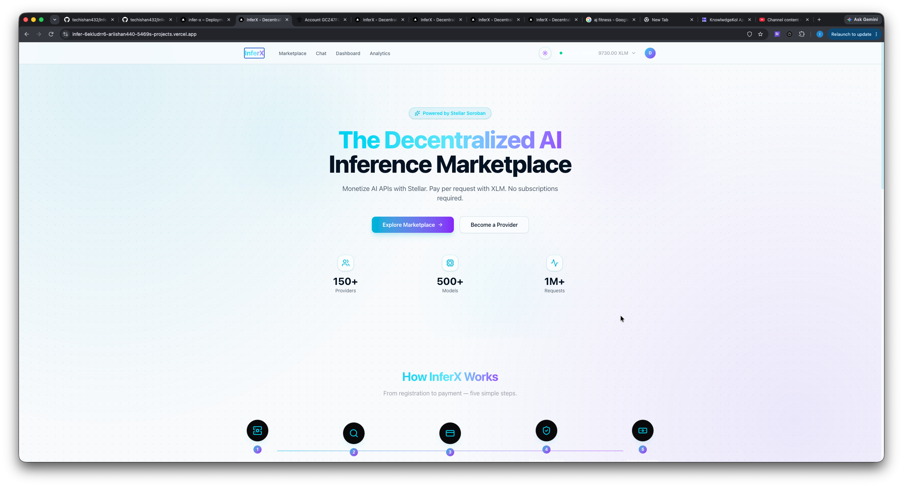
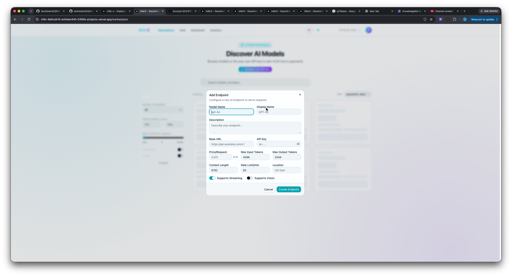
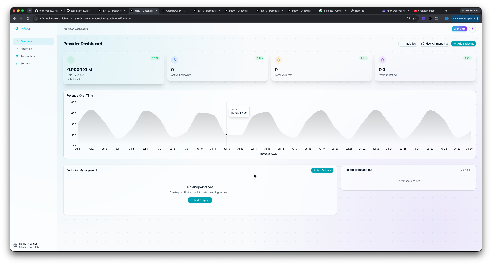
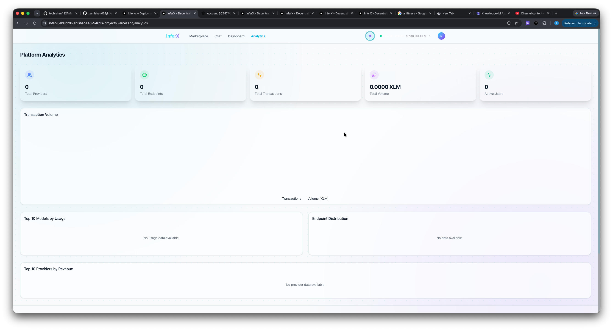
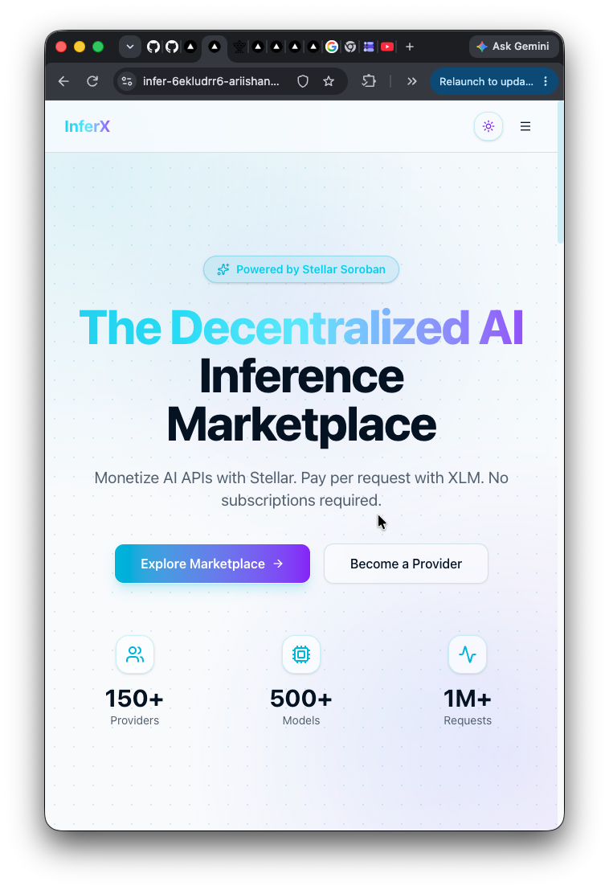
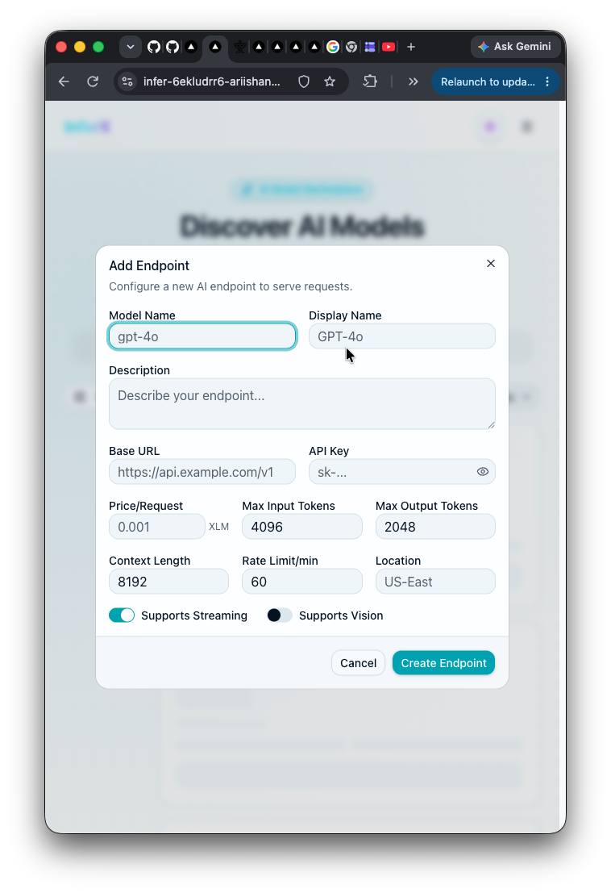
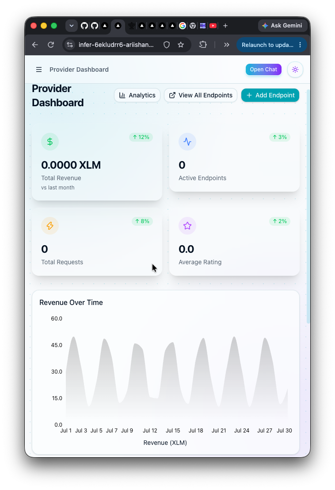

# InferX

> **The Decentralized AI Inference Marketplace powered by Stellar**

[](https://github.com/techishan432/InferX/actions/workflows/ci.yml)

InferX is a decentralized marketplace where AI model providers list their inference endpoints and consumers access them with transparent, on-chain payments via the Stellar blockchain. Built with Next.js and Soroban smart contracts, InferX eliminates middlemen and gives providers full control over pricing while ensuring consumers get the best rates.

## Live Demo

- **Production URL:** [infer-x-olive.vercel.app](https://infer-x-olive.vercel.app/)
- **Live Video Demo:** [YouTube Video](https://youtu.be/6WroQuKLZD8)
- **Testnet Explorer:** [stellar.expert](https://stellar.expert/explorer/testnet/contract/CCL5HTVAJUHP73OG4K3MVBVUPPRTY7UBKB2346YDDVUCE7SEQFZWTQYV)
- **Mobile UI (Responsive):** Fully optimized for mobile, tablet, and desktop (see [screenshots](docs/screenshots/README.md))

## UI Preview

### Desktop
<p align="center">
  
  
  
  
</p>

### Mobile
<p align="center">
  
  
  
</p>

### Desktop (Marketplace)
```
┌─────────────────────────────────────────────────────────────┐
│  InferX              Marketplace  Chat  Dashboard  Analytics │  [Connect Wallet]
├─────────────────────────────────────────────────────────────┤
│                        Discover AI Models                    │
│         Browse and connect with AI models powered            │
│                  by Stellar blockchain payments              │
│                                                              │
│   🔍  Search models, providers...                           │
│                                                              │
│  [Filters]  5 models found                Sort: Popularity ↓│
│  ┌──────────────────────────────────────────────────────┐   │
│  │  Category: All Models                               │   │
│  │  Price Range (XLM): [Min] ─── [Max]                 │   │
│  │  Min Context Length: ═══●══════════ 32K             │   │
│  │  ✓ Streaming    ✓ Vision                            │   │
│  │                5 results                             │   │
│  └──────────────────────────────────────────────────────┘   │
│                                                              │
│  ┌─────────────────┐  ┌─────────────────┐  ┌─────────────┐ │
│  │ ● ONLINE        │  │ ● ONLINE        │  │ ● ONLINE    │ │
│  │ GPT-4o          │  │ DeepSeek V3     │  │ Qwen 2.5    │ │
│  │ AlphaAI Labs    │  │ AlphaAI Labs    │  │ AlphaAI     │ │
│  │ 0.005 XLM/req   │  │ 0.001 XLM/req   │  │ 0.002 XL…   │ │
│  │ ⭐ 4.8 (12)     │  │ ⭐ 4.6 (8)      │  │ ⭐ 4.5      │ │
│  │ [Streaming][👁] │  │ [Streaming]     │  │ [Streaming] │ │
│  │ 128K context    │  │ 64K context     │  │ 32K context │ │
│  └─────────────────┘  └─────────────────┘  └─────────────┘ │
└─────────────────────────────────────────────────────────────┘
```

### Mobile (Chat Interface — 390px)
```
┌───────────┐
│ inferX /  │
│   Chat    │
├───────────┤  ← Hamburger reveals sidebar
│ [≡] [GPT] │
├───────────┤
│ 👤 User   │
│ "Explain  │
│  Stellar" │
├───────────┤
│ 🤖 AI     │
│ "Stellar  │
│  is a     │
│  layer-1  │
│  blockchain│"│
├───────────┤
│ 📎 [Send] │
└───────────┘
```

See [docs/screenshots/](docs/screenshots/README.md) for the full screenshot capture guide.

## Architecture

```
┌─────────────────────────────────────────────────────────────────┐
│                        Frontend (Vercel)                         │
│                 Next.js 15 + React 19 + TailwindCSS              │
│                  Freighter Wallet Integration                     │
└────────────────────────────┬────────────────────────────────────┘
                             │
                    Route Handlers (API)
                             │
              ┌──────────────┼──────────────┐
              │              │              │
              ▼              ▼              ▼
        ┌──────────┐  ┌──────────┐  ┌──────────────┐
        │ Prisma   │  │ Stellar  │  │ Encryption   │
        │ ORM      │  │ SDK      │  │ Service      │
        └────┬─────┘  └────┬─────┘  └──────────────┘
             │              │
             ▼              ▼
      ┌────────────┐ ┌────────────────────────────┐
      │ PostgreSQL │ │    Stellar Network          │
      │ (Neon/     │ │  ┌──────────┐ ┌──────────┐ │
      │  Supabase) │ │  │ Registry │ │ Escrow   │ │
      └────────────┘ │  │ Contract │ │ Contract │ │
                     │  └──────────┘ └──────────┘ │
                     │  ┌──────────┐ ┌──────────┐ │
                     │  │ Ratings  │ │ History  │ │
                     │  │ Contract │ │ Contract │ │
                     │  └──────────┘ └──────────┘ │
                     └────────────────────────────┘
```

## Features

- **Decentralized Registry** — Providers register AI endpoints on-chain via Soroban smart contracts
- **Escrow Payments** — Funds held in escrow until inference is successfully delivered
- **Transparent Ratings** — On-chain rating system for provider accountability
- **Multi-Model Support** — GPT-4o, DeepSeek, Qwen, Llama, Mistral, and more
- **Wallet-First Auth** — Freighter wallet integration for authentication and signing
- **Real-Time Health Monitoring** — Automated health checks for all endpoints
- **Chat Playground** — Interactive chat interface to test any endpoint
- **Analytics Dashboard** — Track usage, costs, earnings, and performance metrics
- **Streaming Responses** — Server-Sent Events for real-time token streaming

## Tech Stack

| Layer | Technology |
|-------|-----------|
| Frontend | Next.js 15, React 19, TypeScript, TailwindCSS |
| Backend | Next.js Route Handlers, Prisma ORM |
| Database | PostgreSQL (Neon / Supabase) |
| Blockchain | Stellar / Soroban Smart Contracts (Rust) |
| Wallet | Freighter Browser Extension |
| Deployment | Vercel |
| Charts | Recharts |
| State | Zustand, TanStack Query |

## Prerequisites

- **Node.js 20+**
- **PostgreSQL** — [Neon](https://neon.tech) or [Supabase](https://supabase.com) recommended
- **Stellar Testnet XLM** — Get free testnet tokens from the [Stellar Friendbot](https://friendbot.stellar.org)
- **Freighter Wallet** — [Install from Chrome Web Store](https://www.freighter.app)
- *(Optional)* **Rust + Soroban CLI** — For smart contract development

## Quick Start

```bash
# Clone the repository
git clone https://github.com/your-org/inferX.git
cd inferX

# Install dependencies
cd apps/web
npm install

# Set up environment variables
cp .env.example .env
# Edit .env with your database URL and keys

# Push database schema
npm run db:push

# Seed development data (optional)
npm run db:seed

# Start development server
npm run dev
```

Open [http://localhost:3000](http://localhost:3000) in your browser.

## Deployment to Vercel

1. Push your code to GitHub
2. Import the project on [vercel.com](https://vercel.com)
3. Set the root directory to `apps/web`
4. Add environment variables in Vercel project settings:
   - `DATABASE_URL` — Your PostgreSQL connection string
   - `DIRECT_URL` — Direct connection string for Prisma
   - `SECRET_KEY` — JWT secret
   - `ENCRYPTION_KEY` — 32-byte encryption key for API keys
   - `REGISTRY_CONTRACT_ID` / `ESCROW_CONTRACT_ID` / `RATINGS_CONTRACT_ID` / `HISTORY_CONTRACT_ID`
   - All `NEXT_PUBLIC_*` variables
5. Deploy — Vercel auto-detects Next.js via `vercel.json`
6. Run migrations on the production database:
   ```bash
   npx prisma db push
   ```

## Smart Contracts

The Soroban contracts live in `contracts/` and are written in Rust.

### Testnet Deployment

All contracts have been successfully deployed to Stellar Testnet.

| Contract | Contract ID | Explorer |
|----------|-------------|----------|
| **Registry** | `CCL5HTVAJUHP73OG4K3MVBVUPPRTY7UBKB2346YDDVUCE7SEQFZWTQYV` | [View](https://stellar.expert/explorer/testnet/contract/CCL5HTVAJUHP73OG4K3MVBVUPPRTY7UBKB2346YDDVUCE7SEQFZWTQYV) |
| **Escrow** | `CBIBPQJ6MBZHZI5CUXA7O4K4SLJELDIJOUP2KOJQR5K5OBUN5OVP3NOS` | [View](https://stellar.expert/explorer/testnet/contract/CBIBPQJ6MBZHZI5CUXA7O4K4SLJELDIJOUP2KOJQR5K5OBUN5OVP3NOS) |
| **Ratings** | `CD2ZMDC3NHIU2EA66CCKXIDG5K3X4E5QXMRCEG7EJIBQB3VWJ5NZ2LKZ` | [View](https://stellar.expert/explorer/testnet/contract/CD2ZMDC3NHIU2EA66CCKXIDG5K3X4E5QXMRCEG7EJIBQB3VWJ5NZ2LKZ) |
| **History** | `CBXPMFNSM3BZPZZOA4AXOCMVOWN2Q4RKME7RRYTFEUQWXP4YSUW7ZUZE` | [View](https://stellar.expert/explorer/testnet/contract/CBXPMFNSM3BZPZZOA4AXOCMVOWN2Q4RKME7RRYTFEUQWXP4YSUW7ZUZE) |

**Deployer Address:** `GAKAWNAR76U2MPDKUZXPYA6S6S4HOTVIXIRXIEKXJXVNA4XUIHGDSLYY`

#### Deployment Transaction Hashes

| Contract | Deployment TX | Explorer |
|----------|---------------|----------|
| **Registry** | `ef1da640c30d353095464c09e2c75fb582e94d7f34c3eea63aeee8952e11bb91` | [View](https://stellar.expert/explorer/testnet/tx/ef1da640c30d353095464c09e2c75fb582e94d7f34c3eea63aeee8952e11bb91) |
| **Escrow** | `b0bf4ca637bea1a234672519accffd1e6d40ae37da5dbd5bfd34b90cfc2b0a9e` | [View](https://stellar.expert/explorer/testnet/tx/b0bf4ca637bea1a234672519accffd1e6d40ae37da5dbd5bfd34b90cfc2b0a9e) |
| **Ratings** | `28bbf5360551c1e0398e29065dd1b248a5e319435f392dba914937503d3adf4d` | [View](https://stellar.expert/explorer/testnet/tx/28bbf5360551c1e0398e29065dd1b248a5e319435f392dba914937503d3adf4d) |
| **History** | `c281b388e93b5cfc251cb9abbfddb7154b9aabb66d28f07662114656392b86f6` | [View](https://stellar.expert/explorer/testnet/tx/c281b388e93b5cfc251cb9abbfddb7154b9aabb66d28f07662114656392b86f6) |

#### Initialization Transaction Hashes

| Contract | Init TX | Explorer |
|----------|---------|----------|
| **Registry** (admin set) | `d7879e1d4128a3c94490756849b41f6af25231ef40d0b8923120c5e06c1879e3` | [View](https://stellar.expert/explorer/testnet/tx/d7879e1d4128a3c94490756849b41f6af25231ef40d0b8923120c5e06c1879e3) |
| **Escrow** (admin + 5% fee) | `f520e55e391e6f33aa646d46a2f02fb4a43334581010e319cfca76938bfcb7e8` | [View](https://stellar.expert/explorer/testnet/tx/f520e55e391e6f33aa646d46a2f02fb4a43334581010e319cfca76938bfcb7e8) |
| **Ratings** (admin set) | `d00a3c779462c2c700481ce5b8b9b941254d51f3baf7b8b15b7eafe0a77ee2ec` | [View](https://stellar.expert/explorer/testnet/tx/d00a3c779462c2c700481ce5b8b9b941254d51f3baf7b8b15b7eafe0a77ee2ec) |
| **History** (admin set) | `64ac9de4851c4fe0953053cf5904f4770ab973e9f043f83d24db4dd74ad583fb` | [View](https://stellar.expert/explorer/testnet/tx/64ac9de4851c4fe0953053cf5904f4770ab973e9f043f83d24db4dd74ad583fb) |

#### Contract Interaction Transaction Hashes

| Action | Transaction Hash | Explorer |
|--------|------------------|----------|
| **Register Provider** (`registry.register_provider`) | `c451c7caa154969763094ccd15cdc01b73f18e1427cf6b1fcc542a2566ba3ba8` | [View](https://stellar.expert/explorer/testnet/tx/c451c7caa154969763094ccd15cdc01b73f18e1427cf6b1fcc542a2566ba3ba8) |
| **Submit Review** (`ratings.submit_review`, rating=5) | `ef3b9a01aa3b5ea520b8f3ab32cbe6ec2649701a7808c367801ab3d694f9a288` | [View](https://stellar.expert/explorer/testnet/tx/ef3b9a01aa3b5ea520b8f3ab32cbe6ec2649701a7808c367801ab3d694f9a288) |

### Build & Deploy

```bash
# Install Soroban CLI
cargo install soroban-cli

# Build and deploy all contracts to testnet
chmod +x scripts/deploy-contracts.sh
./scripts/deploy-contracts.sh testnet

# Deploy to mainnet
./scripts/deploy-contracts.sh mainnet
```

### Contract Overview

| Contract | Purpose |
|----------|---------|
| **Registry** | Store provider and endpoint metadata on-chain |
| **Escrow** | Hold funds between consumer and provider during inference |
| **Ratings** | Immutable on-chain rating records |
| **History** | Audit trail of all marketplace transactions |

## Environment Variables

| Variable | Description | Required |
|----------|-------------|----------|
| `DATABASE_URL` | PostgreSQL connection string | Yes |
| `DIRECT_URL` | Direct PostgreSQL URL (for Prisma migrate) | Yes |
| `NEXT_PUBLIC_APP_URL` | Public app URL | Yes |
| `NEXT_PUBLIC_STELLAR_NETWORK` | `testnet` or `mainnet` | Yes |
| `NEXT_PUBLIC_STELLAR_RPC_URL` | Soroban RPC endpoint | Yes |
| `NEXT_PUBLIC_STELLAR_HORIZON_URL` | Horizon REST API endpoint | Yes |
| `NEXT_PUBLIC_STELLAR_NETWORK_PASSPHRASE` | Stellar network passphrase | Yes |
| `REGISTRY_CONTRACT_ID` | Deployed registry contract ID | Yes |
| `ESCROW_CONTRACT_ID` | Deployed escrow contract ID | Yes |
| `RATINGS_CONTRACT_ID` | Deployed ratings contract ID | Yes |
| `HISTORY_CONTRACT_ID` | Deployed history contract ID | Yes |
| `SECRET_KEY` | JWT signing secret | Yes |
| `ENCRYPTION_KEY` | 32-byte key for encrypting provider API keys | Yes |
| `ADMIN_WALLET_ADDRESS` | Admin Stellar wallet address | No |

## API Routes

| Method | Route | Description |
|--------|-------|-------------|
| GET | `/api/auth/wallet` | Get current session via wallet |
| GET | `/api/endpoints` | List all active endpoints |
| GET | `/api/endpoints/[id]` | Get endpoint details |
| POST | `/api/providers` | Register as a provider |
| GET | `/api/providers/[id]` | Get provider profile |
| POST | `/api/inference/[endpointId]` | Run inference on an endpoint |
| POST | `/api/inference/[endpointId]/stream` | Stream inference via SSE |
| GET | `/api/transactions` | List transactions for current user |
| POST | `/api/ratings` | Submit a rating |
| GET | `/api/dashboard/stats` | Dashboard statistics |
| GET | `/api/health` | API health check |

## Testing

### Soroban Contract Tests

All contracts have comprehensive test coverage. **59 tests pass** across all contracts:

```
$ cd contracts && cargo test --release

test result: ok. 13 passed; 0 failed; 0 ignored; (escrow)
test result: ok. 14 passed; 0 failed; 0 ignored; (history)
test result: ok. 14 passed; 0 failed; 0 ignored; (ratings)
test result: ok. 18 passed; 0 failed; 0 ignored; (registry)
```

Test categories:
- **Registry** (18 tests): Provider/endpoint registration, activation, updates, request counting
- **Escrow** (13 tests): Escrow creation, release, refund, expiration, access control
- **Ratings** (14 tests): Review submission, rating summaries, duplicate prevention
- **History** (13 tests): Transaction recording, provider/consumer stats

### Frontend Tests

Frontend build validated via Next.js production build (type-checks, static analysis):
```bash
cd apps/web && npm run build
```

CI pipeline automatically runs all tests on every push to `main`.
[](https://github.com/techishan432/InferX/actions/workflows/ci.yml)

## Architecture Decisions

- **Route Handlers over API Routes** — Using Next.js App Router route handlers for better type safety and streaming support
- **Prisma + PostgreSQL** — Type-safe database access with migrations; Neon/Supabase for serverless compatibility
- **On-Chain + Off-Chain Hybrid** — Critical operations (payments, ratings, registry) on Stellar; metadata and caching off-chain for performance
- **Encryption at Rest** — Provider API keys encrypted with AES-256-GCM before database storage
- **Wallet-First Identity** — Stellar wallet address as the primary identity; no traditional email/password auth
- **Edge-Ready** — Designed to run on Vercel's edge network for low-latency global access

## Contributing

1. Fork the repository
2. Create a feature branch (`git checkout -b feature/amazing-feature`)
3. Commit your changes (`git commit -m 'Add amazing feature'`)
4. Push to the branch (`git push origin feature/amazing-feature`)
5. Open a Pull Request

## License

MIT
